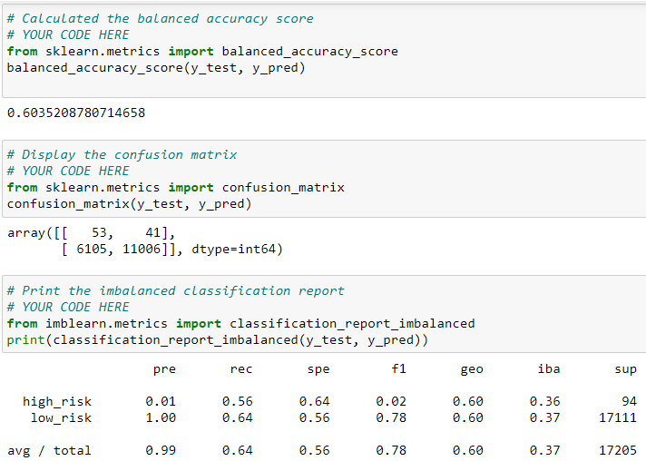
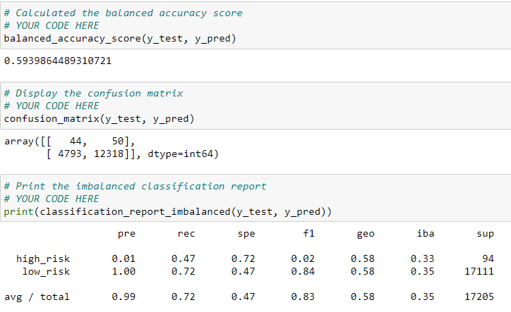
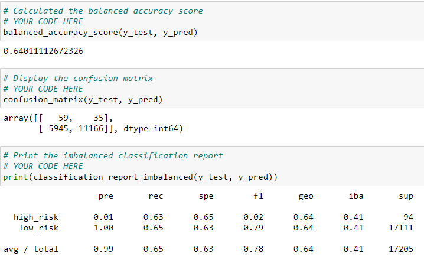
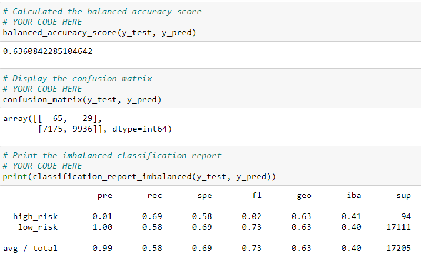
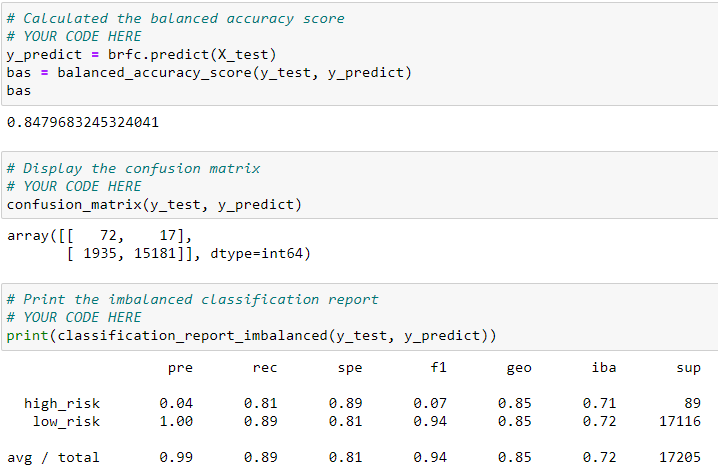
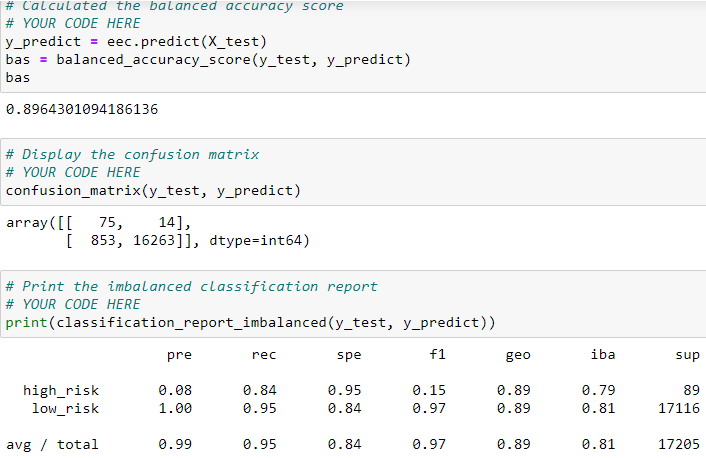

# Credit_Risk_Analysis
### Overview
The purpose of this project was to apply machine learning to solve a real-world challenge: credit card risk. I employed different techniques to train and evaluate models with unbalanced classes. I used imbalance-learn and scikit-learn libraries to build and evaluate models using resampling. Using the credit card credit dataset from LendingClub, a peer-to-peer lending services company, I oversampled the data using the RandomOverSampler and SMOTE algorithms, and under sampled the data using the ClusterCentroids algorithm. Then I used a combinatorial approach of over and under sampling using the SMOTEENN algorithm. Next I compared two new machine learning models that reduce bias, BalancedRandomForestClassifier and EasyEnsembleClassifier, to predict credit risk.
### Results
Oversampling
Naïve Random Oversampling

SMOTE Oversampling

Under Sampling
Cluster Centroids Algorithm

Combination (Over and Under) Sampling
SMOTEENN

Ensemble Learners
Balanced Random Forest Classifier

Easy Ensemble AdaBoost Classifier

